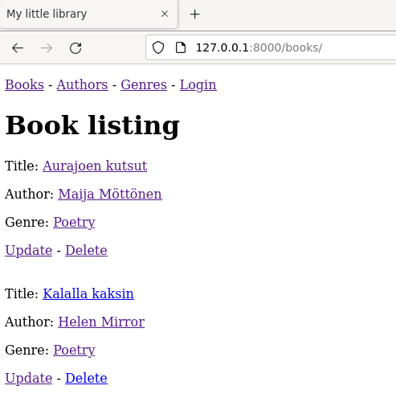

# mybooks
A django CRUD experiment. This is my personal library, where registered users can use the CUD functionality and anonymous users can browse books, authors and genres.

Source for exersice [Tero Karvinen](https://terokarvinen.com/2021/python-web-service-from-idea-to-production-2022/#pw4-mybooks)

Made by: https://www.linkedin.com/in/kalletolonen/

**Project scope:**
CRUD for a book listing - **DONE**

**Stretch goals:**
LoginRequiredMixin - **DONE**  
CreateView, User, UserForm - **NOT DONE**

**Requirements:**  
Django 3.2
Debian 11



### How to use this

```
0. mkdir thisismytopdirectoryforaproject && cd thisismytopdirectoryforaproject
1. git clone https://github.com/kalletolonen/mybooks.git
2. cd mybooks
3. source env/bin/activate
4. cd library
5. ./manage.py createsuperuser
6. navigate to localhost:8000/admin/ -> login with your superuser credentials
7. Add users & add them to loaners group
8. navigate to localhost:8000/books/
9. Try it out!
```

Source for unique=True:
https://stackoverflow.com/questions/3052975/django-models-avoid-duplicates

Source for user auth:
https://developer.mozilla.org/en-US/docs/Learn/Server-side/Django/Authentication#testing_the_new_authentication_pages
